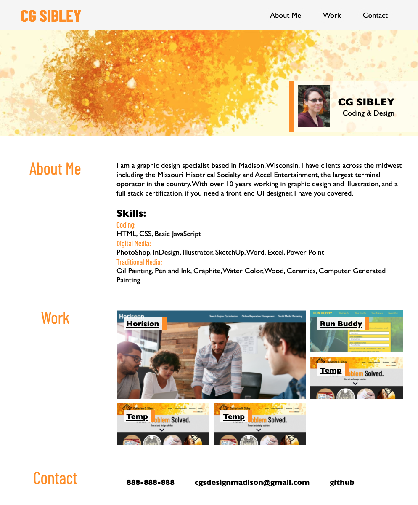

# Portfolio Challenge - Week 2
​
## Creating a Clear and Responsive Personal Portfolio

### Live site at [CG Sibley Design](https://cgsdesign.github.io/portfolio/)
### Code at [CG Sibley Design Github](https://github.com/cgsdesign/portfolio)
​
​For this project I created a personal webpage for my portfolio. The goal was to create a clear and concise page to describe me, show my work, and allow others to contact me.
The branding follows my personal print collateral. The page is designed to be fully responsive and intuitive in order to bring in recruiters and future employers.​

## Key Features
* responsive design optimized for a wide variety of phones and tablets
* header nav to jump to main sections
* recent photo
* about me section
* portfolio sample section using flex grid 
* various links to my pages/ places for new projects
* featured project
* hover effects on all links and grid elements
* live contact links as well as links to my github
* organized CSS by page flow
* concise CSS
* clear internal documentation
* semantic HTML5 elements
* clear and concise page title

## Credits
​
Barlow Condensed font by Jeremy Tribby hosted by Google Fonts.
​
​References: 
​https://www.pluralsight.com/guides/semantic-html

​License text curtasy of https://choosealicense.com/licenses/mit/
​
​
## License

Copyright (c) 2020 Catherine Sibley

Licensed under the MIT license.

Permission is hereby granted, free of charge, to any person obtaining a copy of this software and associated documentation files (the "Software"), to deal in the Software without restriction, including without limitation the rights to use, copy, modify, merge, publish, distribute, sublicense, and/or sell copies of the Software, and to permit persons to whom the Software is furnished to do so, subject to the following conditions:

The above copyright notice and this permission notice shall be included in all copies or substantial portions of the Software.

THE SOFTWARE IS PROVIDED "AS IS", WITHOUT WARRANTY OF ANY KIND, EXPRESS OR IMPLIED, INCLUDING BUT NOT LIMITED TO THE WARRANTIES OF MERCHANTABILITY,
FITNESS FOR A PARTICULAR PURPOSE AND NONINFRINGEMENT. IN NO EVENT SHALL THE
AUTHORS OR COPYRIGHT HOLDERS BE LIABLE FOR ANY CLAIM, DAMAGES OR OTHER
LIABILITY, WHETHER IN AN ACTION OF CONTRACT, TORT OR OTHERWISE, ARISING FROM, OUT OF OR IN CONNECTION WITH THE SOFTWARE OR THE USE OR OTHER DEALINGS IN THE SOFTWARE.
